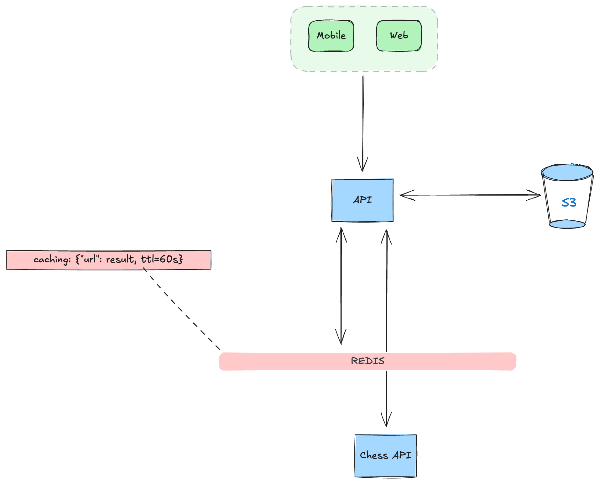

# chess-rankings

## Introduction

###### Chess Rankings is a project that provides an API to retrieve and analyze chess player rankings and their rating history.

### Video

#### I explained and tested the project in a video. You can watch it to understand the implementation details and see the project in action.

[](https://www.youtube.com/watch?v=1234567890)

## Summary

* [Technology Stack](#technology-stack)
* [Code Design](#code-design)
* [System Design](#system-design)
* [Testing](#testing)
* [CI/CD](#cicd)
* [Executing the project](#executing-the-project)
* [API Documentation](#api-documentation)

## Technology Stack

- Python 3.13
- FastAPI
- AWS
- Localstack
- Redis
- Boto3
- Requests
- Uvicorn
- Pydantic

###### For testing and development, the following tools are used:

- Pytest
- Coverage
- Ruff
- Behave
- Httpx
- Pandas

## Code Design

The code is structured to follow best practices, with a focus on modularity and maintainability. The components were
designed using Ports and Adapters (Hexagonal) architecture, which allows for separation of concerns and easy integration
with external systems. The main components include:

- **application**:
    - port: Contains the components of the application layer, including the Ports Interfaces (**Driven/Driver**) and IO
      models (**Command/Query**) with validation and formatting;
    - usecase: Contains the use cases of the application, which implement the Driver Ports and interact with the domain
      layer;
- **domain**: The domain layer for this application is minimal, containing only the value objects used within the Use
  Cases. It is designed to be extensible, allowing for future growth and complexity as needed;
- **infra**: The infrastructure layer contains the implementation of the Driven/Driver Ports, such as database access,
  external
  APIs, http routing and other integrations. It includes:
    - **adapter**: Contains the adapters for the Ports;
        - **driven**:
            - **api**: Responsible for the External API integration, specifically for fetching chess player data from
              the
              Lichess API;
            - **console**: Contains the console handler to print the results of the use cases to the console;
            - **service**: Contains the file service for handling file operations, such as writing CSV files;
            - **storage**: Contains the storage handler for managing AWS S3 interactions, including uploading and
              downloading
              files;
        - **driver**:
            - **rest**: Contains the REST API implementation using FastAPI, including the routes and controllers;
    - **config**: Contains the configuration settings for the application, including environment variables and
      application settings such as exception handling, logging, and other configurations;

[Go to page beginning](#chess-rankings)

## System Design

The system is designed to be light and avoid unnecessary requests to external APIs. It uses a combination of caching and
content storage to optimize performance and reduce the load on the external API.

- **Caching**: The system caches the chess api responses for 60 seconds (only for testing purposes, we can adapt this in
  a real production environment)
- **Content Storage**: The system stores the generated CSV files in AWS S3, so they can be accessed and downloaded later
  without needing to regenerate them and protect the files in a private S3 Bucket. The current system is configured to
  use Localstack for local development and testing. But it is already integrated with AWS S3, so it can be easily
  deployed and used with real cloud just by changing the environment variables.

###



## Testing

The project includes comprehensive testing to ensure the functionality and reliability of the API. The testing strategy
chosen uses a combination of unit tests, integration tests, and acceptance tests. We can run each type of test using the
scripts defined in the Makefile.

```bash
make unit
make integration
make e2e
```

## CI/CD

It was implemented a CI pipeline using GitHub Actions to automate the testing. The pipeline includes unit tests,
integration tests, code coverage reporting, and is triggered on every push to the main branch and on pull requests,
failing when the code coverage is below 80%.

[Go to page beginning](#chess-rankings)

## Executing the project

### Prerequisites

- [Docker](https://docs.docker.com/get-docker/)
- [Docker Compose](https://docs.docker.com/compose/install/)
- [GNU Make 3.81](https://www.gnu.org/software/make/)

### Execution Steps

**I highly recommend using GNU Make to simplify the execution of the project. The Makefile provides several targets to
manage the project startup and testing.**

```bash
make up
```

### API Documentation

Once the project is running, you can access the API documentation at: http://localhost:3000/

### Technical Challenge Requirements

#### Part 1

- List the top 50 classical chess players. Just print their usernames.

#### Part 2

- Print the rating history for the top chess player in classical chess for the last 30 calendar days. This can be in the
  format assuming today is Sep 15:

```txt
- username, {Sep 15: 990, Sep 14: 991, ...,  Aug 17: 932, Aug 16: 1000}
```

**Key assumption: If a player doesn't play, then the score stays the same.**

#### Part 3

- Create a CSV that shows the rating history for each of these 50 players, for the last 30 days.
    - The first column should be the player’s username.
    - The 2nd column should be the player’s rating 30 days ago.
    - The 32nd column should be the player’s rating today.
    - The CSV should have 51 rows (1 header, 50 players).
    - The CSV should be in the same order of the leaderboard.
    - The first column in the csv should be the username of the player.
    - Columns afterward should be the player's rating on the specified date.
    - A CSV could look like this:
    - ```csv
        username,2022-01-01,2022-01-02,2022-01-03,.....,2022-01-31
        bob,1231,1158,1250,...,1290
        notagm,900,900,900,...,900
      ```

[Go to page beginning](#chess-rankings)
